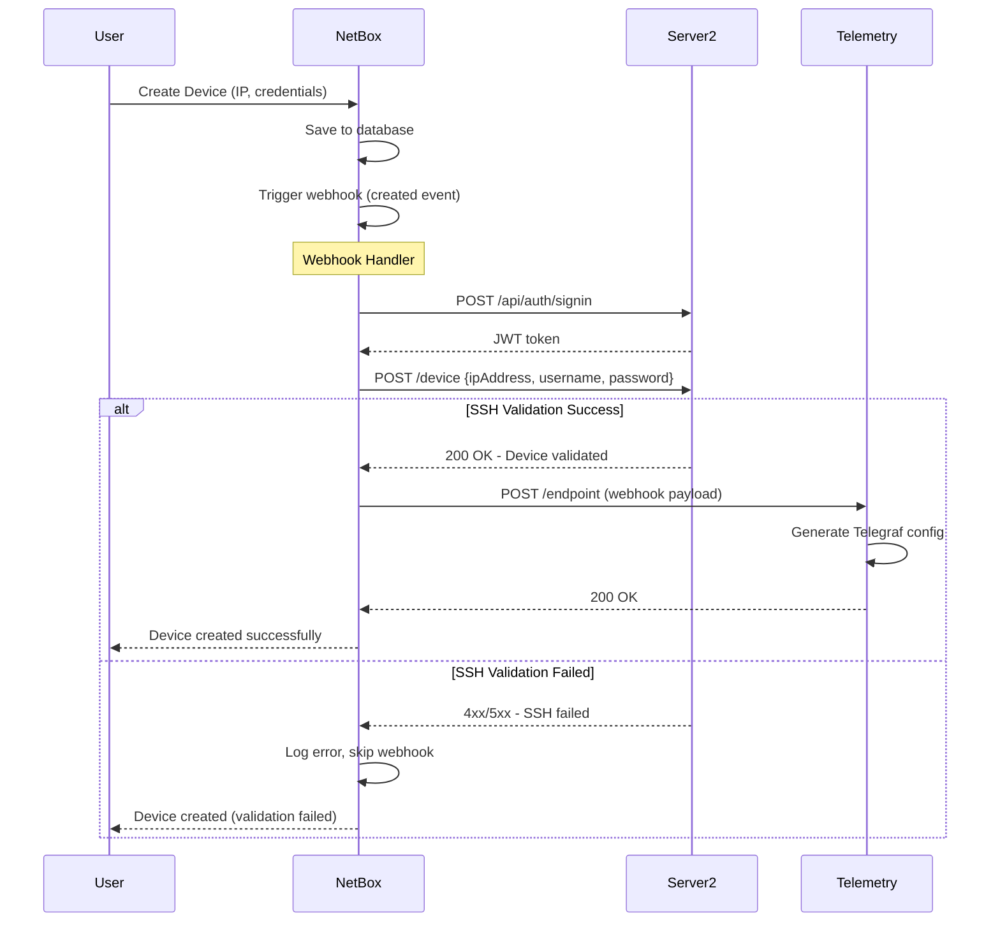

# NetBox Server2 NMS Integration - Architecture Documentation

## Overview

This document describes the architecture of the Server2 NMS integration in NetBox, which validates device SSH credentials before triggering telemetry configuration generation.

## Problem Statement

**Original Issue**: With 20,000+ devices, having the telemetry service validate each device with Server2 creates a bottleneck:
- Telemetry receives webhook → validates with Server2 → generates config
- 20k devices = 20k HTTP calls from telemetry service
- Telemetry becomes a single point of failure

**Solution**: Move validation to NetBox webhook handler:
- NetBox validates once → only sends webhook if valid
- Telemetry only receives pre-validated devices
- Telemetry focuses on config generation only

## Architecture Diagram



## Component Architecture

### 1. Server2 Client (`server2_client.py`)

**Purpose**: Encapsulates all Server2 API interactions

**Key Classes**:
- `Server2Client`: Main client class
  - `authenticate()`: Get JWT token from Server2
  - `validate_device()`: Validate device SSH credentials
  - `close()`: Clean up session

**Key Functions**:
- `validate_device_with_server2(device_data)`: Convenience function for webhook handler

**Configuration Sources** (in order of precedence):
1. Function parameters
2. Django settings (`settings.SERVER2_*`)
3. Environment variables (`SERVER2_*`)
4. Defaults

### 2. Webhook Handler (`webhooks.py`)

**Modified Function**: `send_webhook()`

**New Logic**:
```python
if object_type.model == 'device' and event_type == 'created':
    # Validate with Server2
    result = validate_device_with_server2(data)
    
    if not result['success']:
        # Log error and return early (no webhook sent)
        return f"Server2 validation failed: {result['message']}"
    
    # Continue with webhook...
```

**Event Handling**:
| Event | Validation | Webhook Sent |
|-------|-----------|--------------|
| `created` | ✅ Yes | Only if valid |
| `updated` | ❌ No | Always |
| `deleted` | ❌ No | Always |

## Data Flow

### Device Creation Flow

```
1. User creates device in NetBox
   ├─ IP: 10.4.160.240
   ├─ Username: rootadmin (custom field)
   └─ Password: Root@123 (custom field)

2. NetBox saves device to database

3. NetBox triggers webhook (created event)

4. Webhook handler extracts device data
   ├─ IP from primary_ip4.address
   ├─ Username from custom_fields.username
   └─ Password from custom_fields.password

5. Server2Client.authenticate()
   └─> POST http://10.4.160.240:8081/api/auth/signin
       {username: "admin", password: "admin"}
       ← JWT token

6. Server2Client.validate_device()
   └─> POST http://10.4.160.240:8081/device
       {ipAddress: "10.4.160.240", username: "rootadmin", password: "Root@123"}
       
7a. If SUCCESS (200):
    ├─ Log success
    ├─ Continue with webhook
    └─> POST http://telemetry:5000/endpoint
        {event: "created", data: {...}}

7b. If FAIL (4xx/5xx):
    ├─ Log error
    └─ Return early (no webhook sent)
```

## Configuration

### NetBox Settings

```python
# configuration.py
SERVER2_VALIDATION_ENABLED = True
SERVER2_BASE_URL = 'http://10.4.160.240:8081'
SERVER2_AUTH_ENDPOINT = '/api/auth/signin'
SERVER2_DEVICE_ENDPOINT = '/device'
SERVER2_USERNAME = 'admin'
SERVER2_PASSWORD = 'admin'
```

### Environment Variables

```bash
export SERVER2_VALIDATION_ENABLED=true
export SERVER2_BASE_URL=http://10.4.160.240:8081
export SERVER2_AUTH_ENDPOINT=/api/auth/signin
export SERVER2_DEVICE_ENDPOINT=/device
export SERVER2_USERNAME=admin
export SERVER2_PASSWORD=admin
```

## Error Handling

### Authentication Errors

**Scenario**: Server2 authentication fails

**Handling**:
```python
if not client.authenticate():
    return {
        'success': False,
        'status_code': 401,
        'message': 'Failed to authenticate with Server2'
    }
```

**Result**: Webhook not sent, error logged

### Validation Errors

**Scenario**: Device SSH validation fails

**Handling**:
```python
if response.status_code != 200:
    return {
        'success': False,
        'status_code': response.status_code,
        'message': error_message
    }
```

**Result**: Webhook not sent, error logged

### Network Errors

**Scenario**: Server2 unreachable

**Handling**:
```python
except requests.exceptions.RequestException as e:
    return {
        'success': False,
        'status_code': 500,
        'message': f'Server2 request failed: {str(e)}'
    }
```

**Result**: Webhook not sent, error logged

### Missing Data Errors

**Scenarios**:
- Device has no primary IP
- Device has no SSH credentials

**Handling**:
```python
if not primary_ip4:
    return {'success': False, 'message': 'Device has no primary IP address'}

if not username or not password:
    # Use defaults
    username = username or 'admin'
    password = password or 'admin'
```

## Performance Considerations

### Scalability

**20,000 Devices**:
- Old approach: 20k HTTP calls from telemetry
- New approach: 20k HTTP calls from NetBox (but only once per device creation)

**Benefits**:
- Telemetry service simplified (no HTTP calls)
- Validation happens at device creation time (one-time cost)
- Telemetry only processes valid devices (faster)

### Timeouts

```python
# Authentication timeout: 10 seconds
response = self.session.post(auth_url, json=payload, timeout=10)

# Device validation timeout: 30 seconds
response = self.session.post(device_url, json=payload, timeout=30)
```

### Connection Pooling

Uses `requests.Session()` for connection pooling:
```python
self.session = requests.Session()
```

## Security Considerations

### Credentials Storage

- Server2 credentials stored in NetBox configuration
- Device SSH credentials stored in NetBox custom fields
- Transmitted over HTTP (consider HTTPS in production)

### Token Management

- JWT token obtained per validation request
- Token stored in session for reuse
- Session closed after validation

## Testing

### Unit Tests

See `test_server2_integration.py`:
1. Authentication test
2. Valid device validation
3. Invalid device validation
4. Missing IP handling
5. Missing credentials handling

### Integration Tests

1. Create device with valid credentials → verify webhook sent
2. Create device with invalid credentials → verify webhook NOT sent
3. Update device → verify webhook sent (no validation)
4. Delete device → verify webhook sent (no validation)

## Monitoring and Logging

### Log Levels

```python
# INFO: Normal operations
logger.info("Authenticating with Server2...")
logger.info("Device validation successful")

# WARNING: Validation failures
logger.warning("Device validation failed: SSH authentication failed")

# ERROR: System errors
logger.error("Server2 authentication request failed")
```

### Log Format

```
INFO netbox.webhooks.server2: Authenticating with Server2 at http://10.4.160.240:8081/api/auth/signin
INFO netbox.webhooks.server2: Server2 authentication successful
INFO netbox.webhooks.server2: Validating device 10.4.160.240 with Server2
INFO netbox.webhooks.server2: Device 10.4.160.240 validation successful: Given device is added successfully
```

## Migration Path

### Phase 1: Deploy NetBox Changes
1. Add `server2_client.py`
2. Update `webhooks.py`
3. Configure Server2 settings
4. Test with sample devices

### Phase 2: Verify Behavior
1. Monitor NetBox logs for validation results
2. Verify telemetry only receives valid devices
3. Check Server2 load

### Phase 3: Clean Up Telemetry Service
1. Remove NMS validation from telemetry
2. Remove NMS-related environment variables
3. Simplify telemetry handler

## Future Enhancements

1. **Async validation**: Use async HTTP calls for better performance
2. **Retry logic**: Retry failed validations with exponential backoff
3. **Caching**: Cache validation results for a short period
4. **Batch validation**: Validate multiple devices in a single request
5. **Metrics**: Add Prometheus metrics for validation success/failure rates
